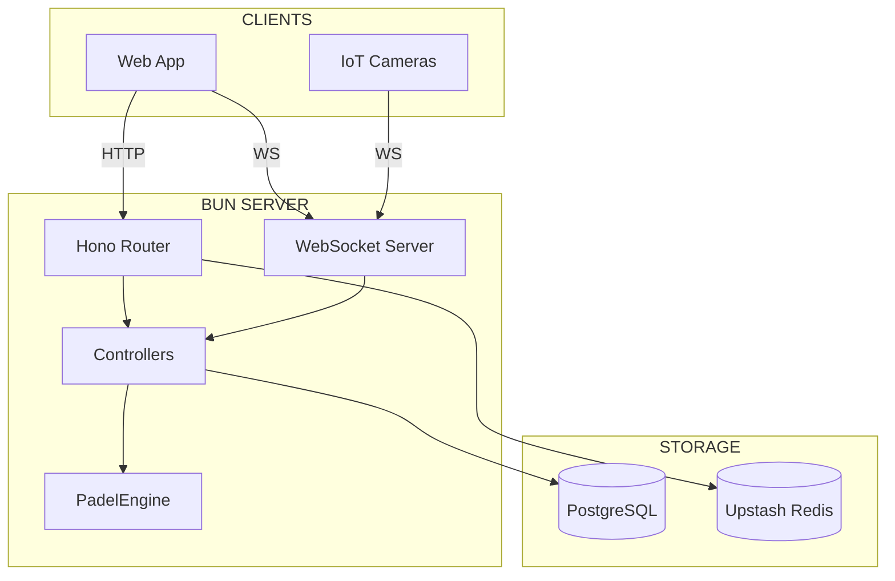
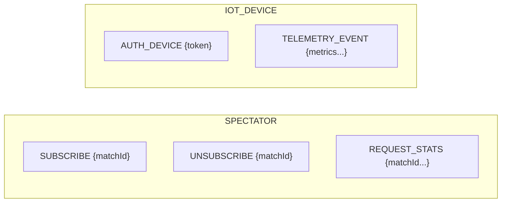
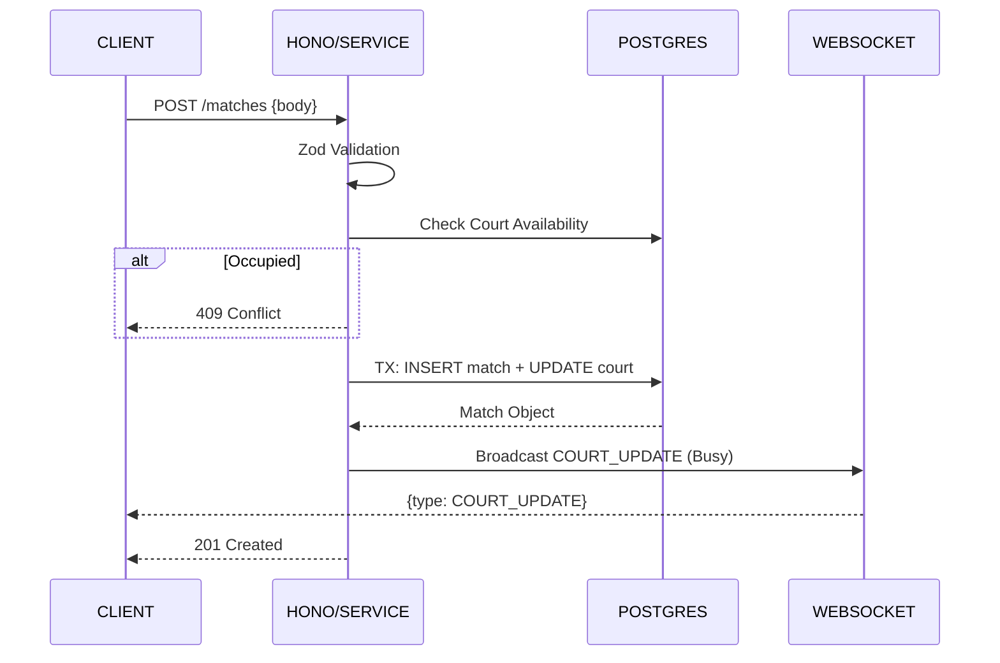
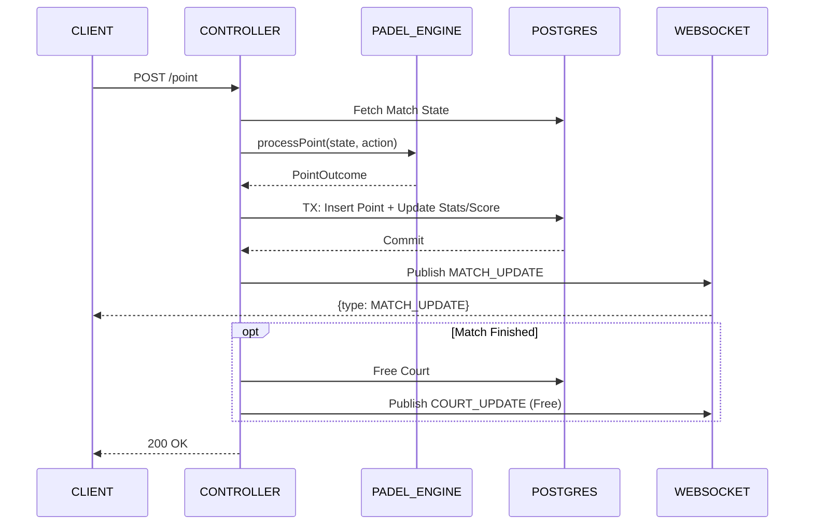
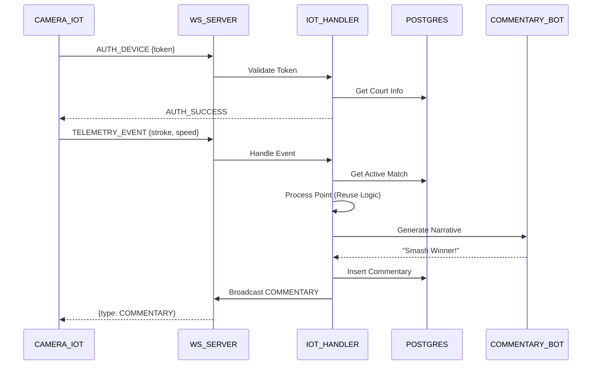
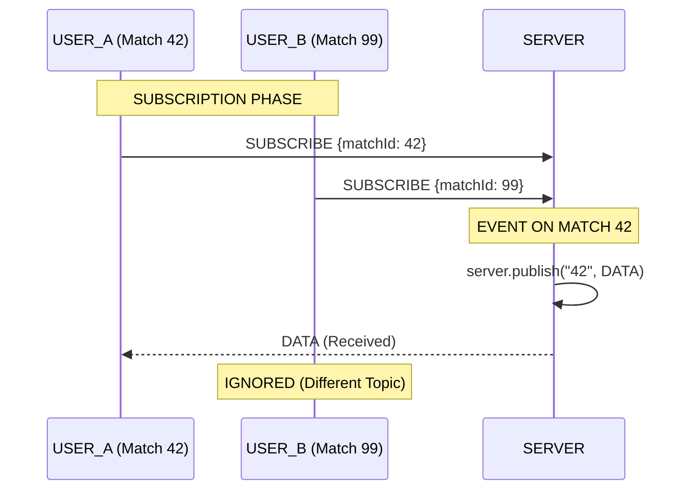
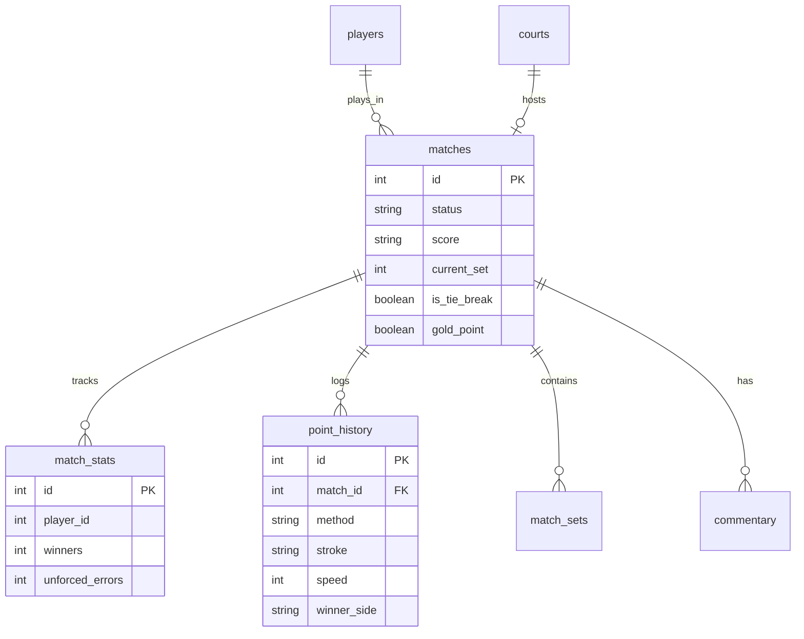

# 🧠 STATE_OF_THE_ART :: PADEL-COUNTERS

> **LAST_UPDATE:** FEB 2026
> **STATUS:** PRODUCTION_READY
> **DOCS_VERSION:** 2.0.0

---

## 01 __ SYSTEM_ARCHITECTURE



| COMPONENT | TECHNOLOGY |
| :--- | :--- |
| **Runtime** | `Bun 1.x` |
| **HTTP Router** | `Hono` |
| **WebSocket** | `Bun Native` (ServerWebSocket) |
| **Database** | `PostgreSQL` + `Drizzle ORM` |
| **Rate Limit** | `Upstash Redis` (Sliding Window) |
| **Validation** | `Zod` |

---

## 02 __ HTTP_INTERFACE (REST)

### 02.1 __ ROUTE_MANIFEST

| PREFIX | FILE | DESCRIPTION |
| :--- | :--- | :--- |
| `/matches` | `matches.ts` | Match CRUD & Operations |
| `/matches/:id/commentary` | `commentary.ts` | Minute-by-minute feed |
| `/courts` | `courts.ts` | Court status & Dashboard |

### 02.2 __ CORE_ENDPOINTS

| METHOD | ENDPOINT | DESCRIPTION | AFFECTED TABLES |
| :--- | :--- | :--- | :--- |
| `GET` | `/` | Health Check | - |
| `GET` | `/matches` | List Matches | `matches` |
| `POST` | `/matches` | Create Match | `matches`, `match_stats` |
| `POST` | `/matches/:id/point` | Register Point | `matches`, `point_history`, `match_stats` |
| `POST` | `/matches/:id/commentary` | Add Commentary | `commentary` |
| `GET` | `/courts` | List Courts | `courts` |

---

## 03 __ WEBSOCKET_INTERFACE

> **URL:** `ws://localhost:8000/ws`
> **RATE_LIMIT:** 5 connections / 10s per IP (Bypass in TEST)

### 03.1 __ CLIENT_TYPES

| TYPE | AUTHENTICATION | ALLOWED MESSAGES |
| :--- | :--- | :--- |
| **SPECTATOR** | None | `SUBSCRIBE`, `UNSUBSCRIBE`, `REQUEST_STATS` |
| **IOT_DEVICE** | Token (`AUTH_DEVICE`) | `TELEMETRY_EVENT` |

### 03.2 __ UPSTREAM_MESSAGES (Client -> Server)



| TYPE | PAYLOAD | HANDLER | ACTION |
| :--- | :--- | :--- | :--- |
| `SUBSCRIBE` | `{matchId}` | `subscription.ts` | Join topic + Initial snapshot |
| `UNSUBSCRIBE` | `{matchId}` | `subscription.ts` | Leave topic |
| `REQUEST_STATS` | `{matchId, subtype}` | `stats.ts` | DB Query (On-demand) |
| `AUTH_DEVICE` | `{token}` | `iot.ts` | Validate Token vs Court |
| `TELEMETRY_EVENT` | `{stroke, speed...}` | `iot.ts` | Process Point + Auto-Commentary |

### 03.3 __ DOWNSTREAM_MESSAGES (Server -> Client)

| TYPE | PAYLOAD | TRIGGER |
| :--- | :--- | :--- |
| `WELCOME` | `message` | On Connection |
| `SUBSCRIBED` | `matchId` | Ack Subscription |
| `AUTH_SUCCESS` | `{courtName}` | Ack Broker Auth |
| `MATCH_UPDATE` | `{snapshot, lastPoint}` | Point Scored / Subscribed |
| `COMMENTARY` | `{message, tags}` | New Commentary Event |
| `COURT_UPDATE` | `{courtId, status}` | Court State Change |
| `ERROR` | `message` | Exception / Fail |

---

## 04 __ DATA_FLOW_SEQUENCES

### 04.1 __ MATCH_CREATION_FLOW



**Context:**
*   **Courts**: Atomic check for `activeMatchId IS NULL`.
*   **Init**: Create `match`, `match_stats` (x4), Update `court`.

### 04.2 __ POINT_SCORING_FLOW



### 04.3 __ IOT_TELEMETRY_FLOW



### 04.4 __ PUB_SUB_BROADCAST_FLOW

> **NOTE:** Native Bun Pub/Sub ensures efficient topic-based delivery.



---

## 05 __ DATA_MODEL_SCHEMA



---

## 06 __ SECURITY_LAYERS

| LAYER | MECHANISM |
| :--- | :--- |
| **Rate Limiting** | `Upstash Redis` (5 req / 10s per IP) |
| **IoT Auth** | `AuthToken` (Unique per Court) |
| **Input Validation** | `Zod` (Strict Schemas) |
| **IP Detection** | `CF-Connecting-IP` / `X-Forwarded-For` |

---

## 07 __ FILE_MANIFEST

```text
src/
├── index.ts              # Entry Point
├── routes/
│   ├── matches.ts        # Match/Point Endpoints
│   └── commentary.ts     # Commentary Endpoints
├── ws/
│   ├── server.ts         # WS Router
│   ├── utils.ts          # Broadcast Logic
│   └── handlers/
│       ├── subscription.ts
│       ├── stats.ts
│       └── iot.ts
├── services/
│   └── matchService.ts   # Core Business Logic
├── utils/
│   ├── padelScoring.ts   # Pure Scoring Engine
│   └── commentaryBot.ts  # NLP Generator
└── db/
    └── schema.ts         # Drizzle Definitions
```
